# Team13 SpeechTherapy Software Specifications
## Building with Unity
SITA is built on [Unity Personal](https://store.unity.com/download?ref=personal) v2019.2.12f1. Building with Unity is fairly straight-forward. Below are the steps for building our project:

Step 1: Open UnityHub and Add v2019.2.12f1 (if not possible, use the latest version)
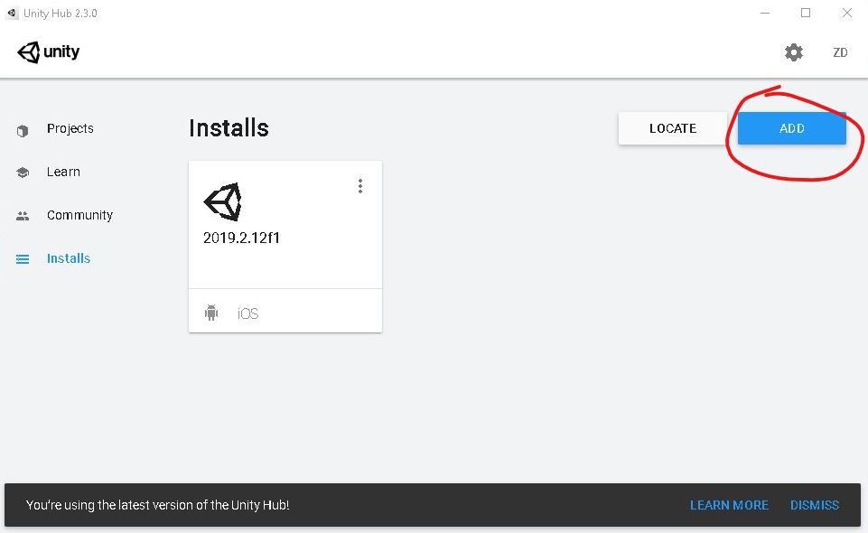
Step 2: Open Modules
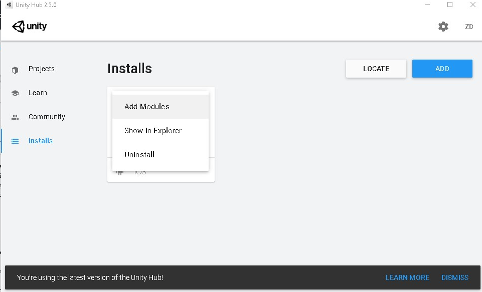
Step 3: Add Android and iOS Build Support (Visual Studio is reccomended for editing scripts) 
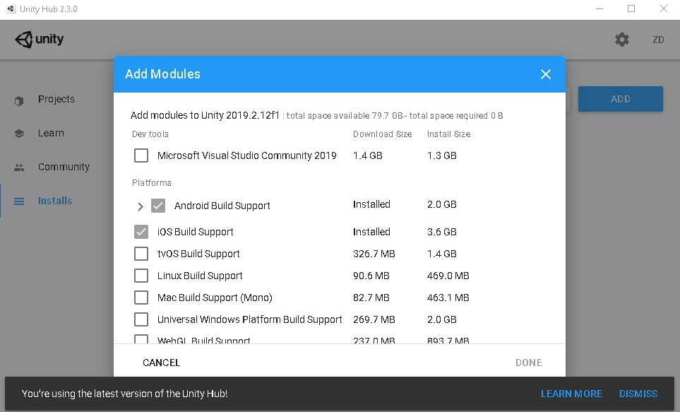
Step 4: Open SITA
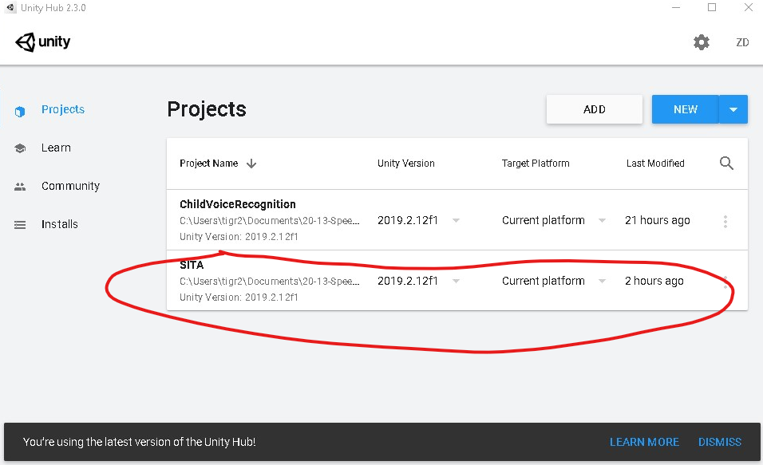
Step 5: Go to File>BuildSettings and add the selected scenes (open scenes in Assets>Scenes and click 'Add Open Scenes'). Build for Android or iOS as desired by clicking 'Build.'
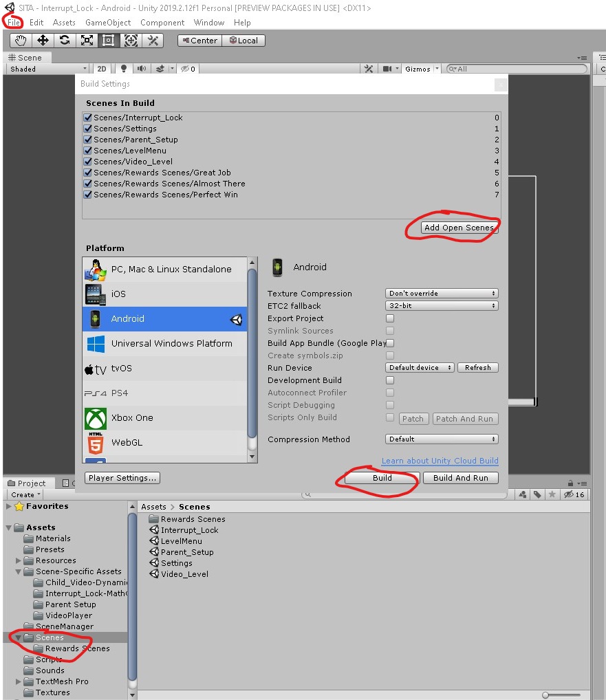

## Software Modules
### SITA/Assets - Assets of the main SITA project.
#### Presets 
1. AudioImporter_MonoNoCompress.preset - Unity preset to import uncompressed WAV files in Resources
#### Resources
1. Easy, Medium, Hard - Folders with the video and audio used in the video player
#### Scene-Specific Assets
1. Interrupt_Lock-MathQuestion - Contains script and prefab for Interrupt_Lock scene 
    a. MathQuestions.cs - Logic for generating random math questions to verify parent is user  
    *Dependencies:*  
    ManageScenes.cs  

2. Parent Setup   
    a. Canvas 1.prefab - Prefab for UI display of Parents Corner which includes buttons for Progress, Settings, Evaluation, and About.  
    b. Parent_settings.cs - script to get information about current video (what the furthest video the child has played is)  

3. Settings

    a. Chosen_Diff.prefab - Prefab for UI display of level difficulty
    *Dependencies:*
    Settings.cs
    
    b. LevelSelector.prefab - Prefab for choosing level difficulty 
    *Dependencies:*
    difficultybutton.cs, SceneManager
    *Connect:*
    1. Expand 'Difficulty Button'
    2. Make 'size' = 3
    3. Drag button 'easy' to 'element 0'
    4. Drag button 'med' to 'element 1'
    5. Drag button 'hard' to 'element 2'

4. Video Player  

    a. VideoPlayer.prefab - Unity prefab for video_level scene  
    *Dependencies:*
    Mic.cs, ModifiedVideoPlayer.cs, Miscellaneous UI elements
    
    b. Mic.cs, ModifiedVideoPlayer.cs - Driver code for voice algorithm   
    *Dependencies:* 
    Speech.cs, Processors.cs, ManageScenes.cs
    
    c. Processors.cs - Speech processing classes that implement the Iprocessor interface      
    *Dependencies:*   
    Speech.cs  
    *Usage:*   
    1.) Call update() to get processing context  
    2.) Call process() per audio buffer in Mic.cs or process in batch in ModifiedVideoPlayer.cs   
    3.) Call get() and retrieve update public field values  
    *Classes:*  
    1.) Envelope - Gets 'memoryInSamples' history of RMS envelope samples. RMS is sampled every chunk and every chunk has 'chunkSize' samples.   
    2.) Spectrogram - Gets 'memoryInSamples' history of "expected" Power Spectral Density values. PSD is samples every 'bufferSize' samples.    
    
    d. Speech.cs - Static class with general speech processing methods  
    *Methods:*  
    1.) trim() - Trims an Envelope object (given processing context) and an envelope threshold/extra. Data before the first envelope threshold hit and after the last threshold hit (plus some extra samples) will be trimmed.  
    2.) errorNoRamp() - Gets the 'error' or distance of a kernel on a moving window against a buffer. Parameter 'p' changes error power and 'overshoot' penalizes overshoot error for values > 1. Used to get final score in Mic.cs.  
    3.) getArgMax() - Gets location of max value of an array. Used in frequency domain analysis in Mic.cs with Spectrogram object's expected values.  
    4.) normalizeMax(), normalize(), normalizeMinMax() - Various normalization functions. Modifies input buffer directly using references. Used in Processors.cs.  
    
 5.) LevelMenu 
 
    a.)
        LevelMenu.prefab - Unity prefab for LevelMenu scene  
            *Dependencies:*
            buttonclicked.cs, Miscellaneous UI elements
    b.) 
        buttonclicked.cs - used to pass information to VideoPlayer, Parent's Corner
            *Connect:*
            1. Expand 'Phenome Listener'
            3. Drag button '1' to 'element 0'
            4. Drag button '2' to 'element 1'
            5. Drag button '3' to 'element 2'
            6. Continue process with all 9 buttons
        
        
#### SceneManager  
1. ManageScenes.cs - Class for asynchronous level loading/switching. Triggered via scene buttons and events.  
*Methods:*  
1.) LockChildVideo() - used in Interrupt_Lock scene. Locks video_level scene for 60 seconds given current time.  
2.) ChangeScene() - asynchronously loads a scene given a string (scene name)  

2. RewardsTimer.cs - Simple script that automatically changes to video_level scene after 10 seconds. Used to leave rewards scenes.  
*Dependencies:*  
ManageScenes.cs
#### Scenes
All scenes of SITA. Depends on everything mentioned in "Software Modules."
### ChildVoice Recognition - Experiemental Untiy Project. Implements video_level with extra plotting and recording features for debugging.

## User Guide
1. Launch SITA on Android or iOS else open the project on Unity 3D.
2. SITA opens with the lock screen prompting you to answer a simple math question to ensure it'sthe parent and not the child.
3. You have unlimited tries to answer the question in this stage.
4. On successfully answering the question you will be taken to the levels screen.
5. On the levels screen there is a parent's corner button, by clicking on that you can track the child's improvement under the Progress tab which displays the current level. You can also set the difficulty level of the game under teh Settings tab.
6. You can click on the Home button on the parent's corner to return to the levels screen.
7. Now choose a level for the child to practice today.
8. Once the level is choosen the game switches from parent's mode to kid's mode.
9. Click on the Play button in the middle of the screen. 
10. A video of the speech pathologist recorded word plays and waits for 10 seconds for the kid to repeat it.
11. Oncle the child replies, the voice algorithm detects the child's voice and scores it based on the accuracy as best, okay or incorrect.
12. Based on the accuracy score the child will be rewarded with 2D visual particle effects, applause and interactive touch particles.
13. After 10 seconds it returns to the next video in the level and continues playing.
14. In order to exit the game and switch back to the parent's mode you will have to answer another math question.
15. To ensure it is the parent quitting the game, this time you have only 3 tries to answer the math question and exit the game if you fail you end up locked in the video screen to keep practicing.

## Demo Screens
The below images of the game display the screen sequence and the flow of the game as you start playing.
### Lock Screen
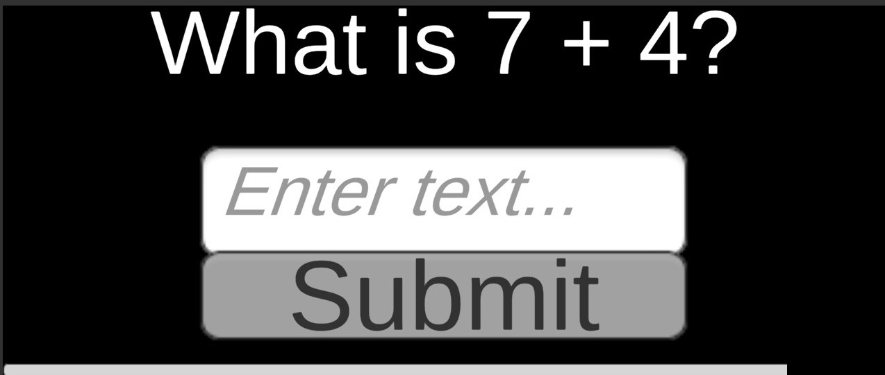

### Levels Screen
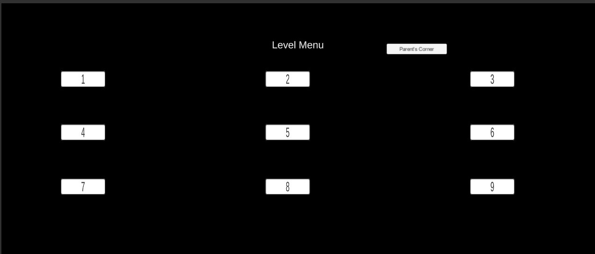

### Parent's Corner - Progress
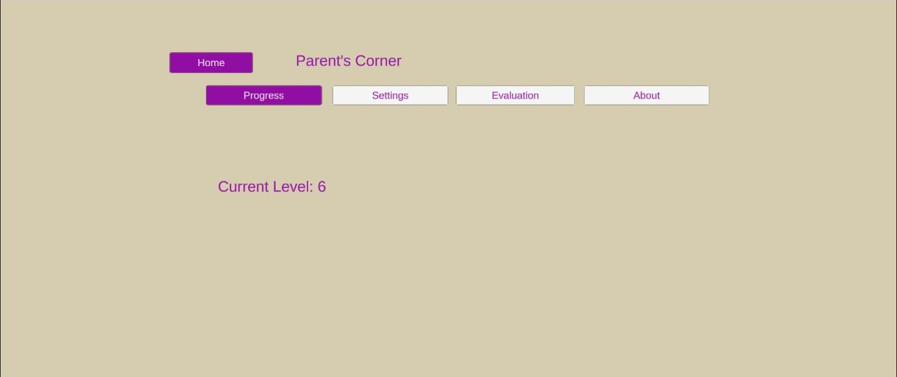

### Parent's Corner - Settings
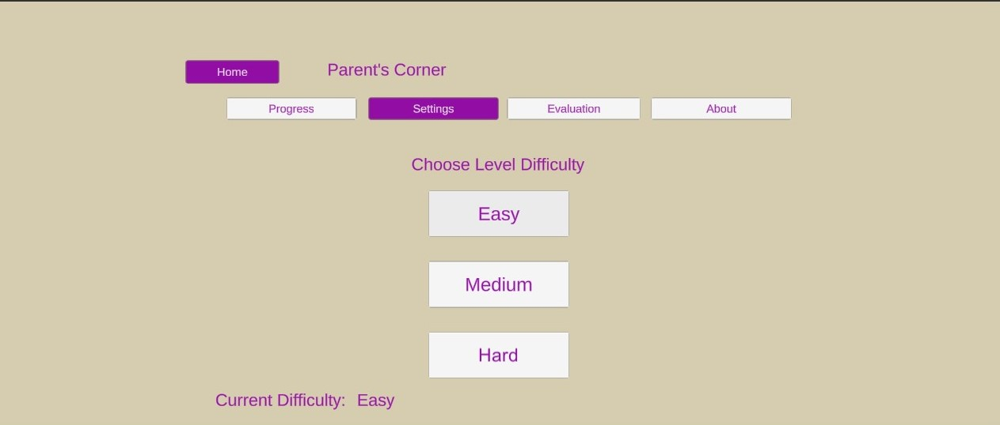

### Play Screen
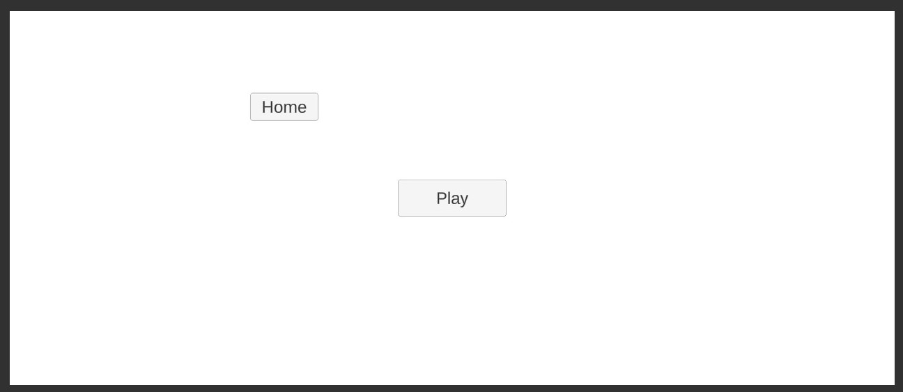

### Video Screen
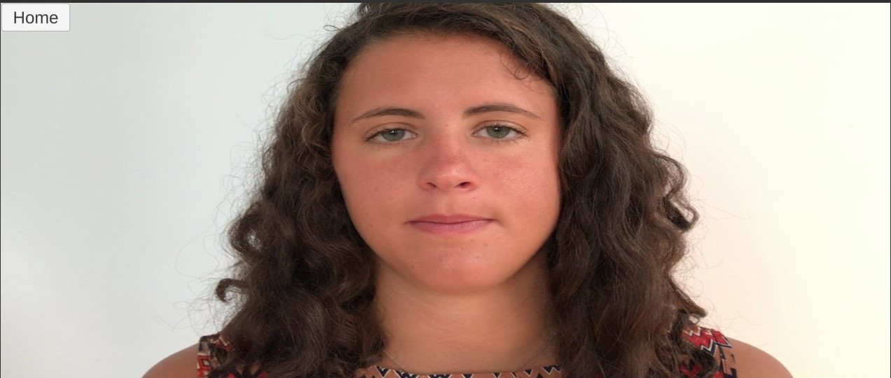

### Reward Screen - Almost There - Accuracy: Incorrect
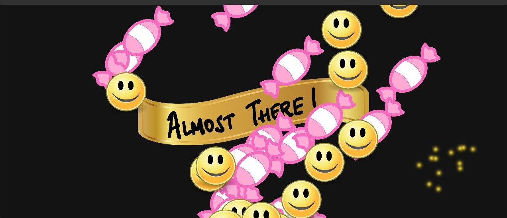

### Reward Screen - Great Job - Accuracy: Okay

### Reward Screen - Perfect Win - Accuracy: Best

### Flowchart of Application 
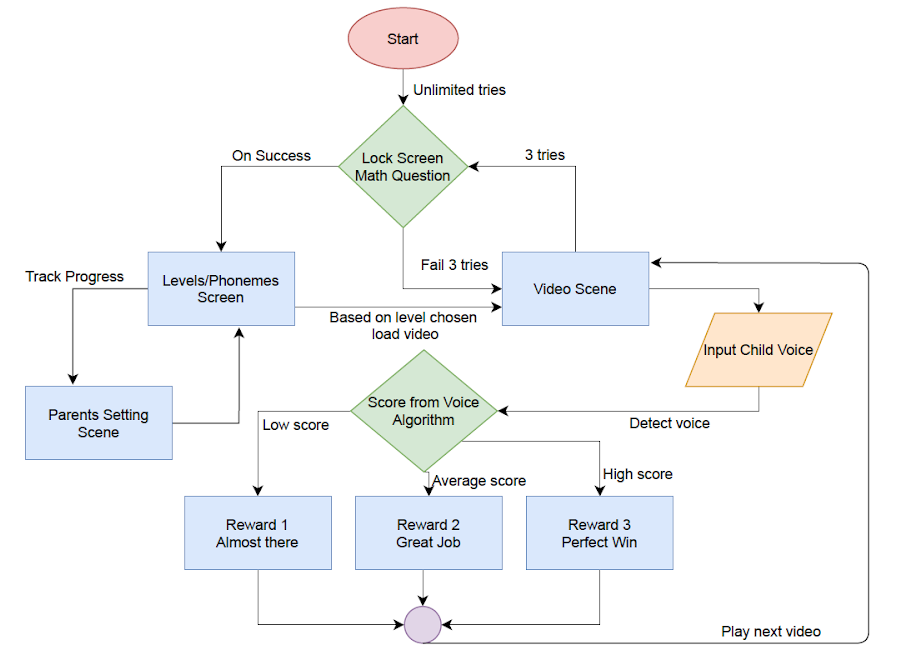

